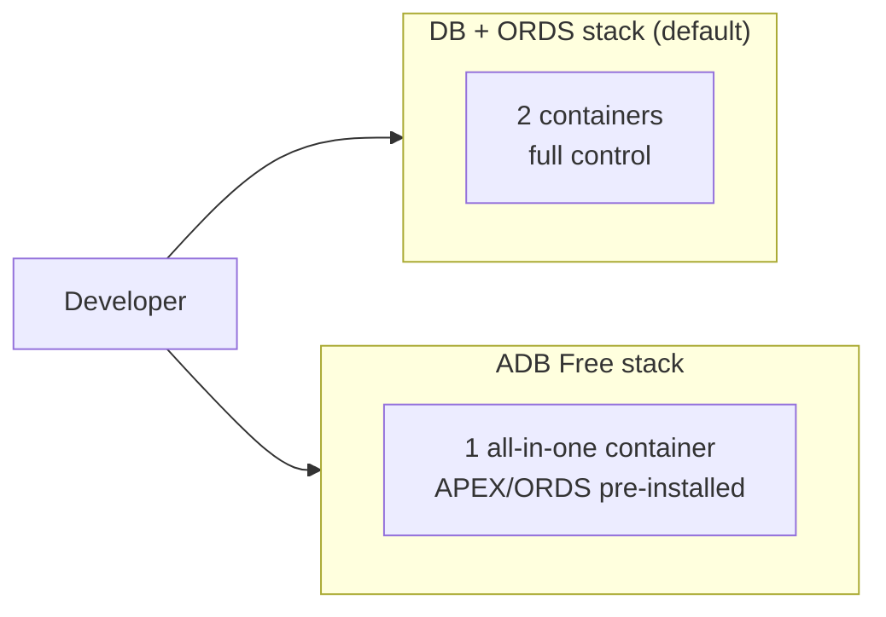
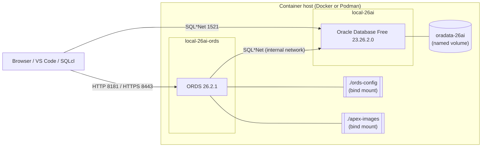
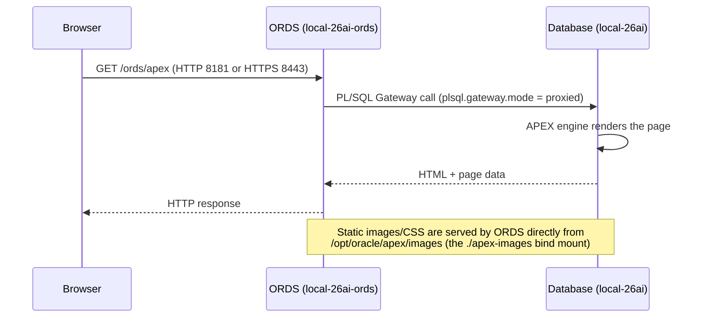
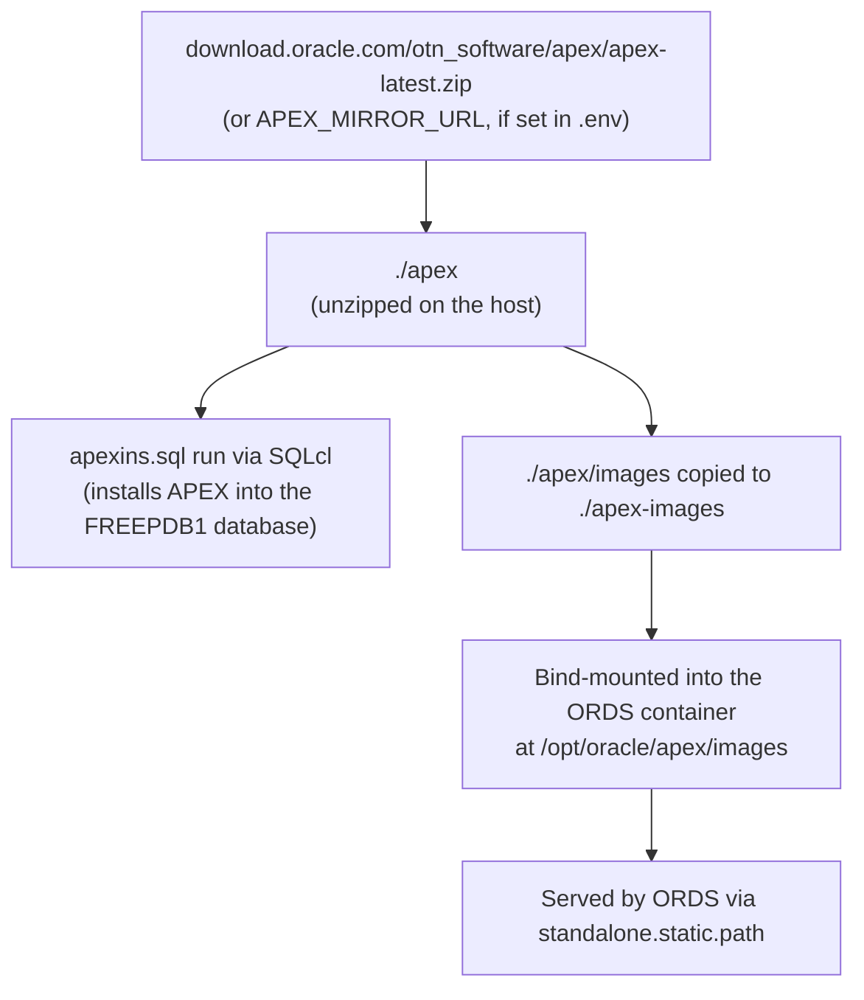
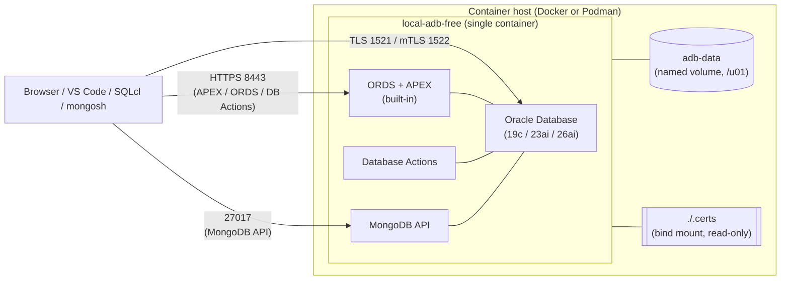

This page explains **what runs where**, **how a request flows through the system**, **where APEX comes
from**, and **where passwords live** — for both stacks this project supports. It's meant as background for
[Onboarding](/products/uc-local-apex-dev/docs/getting-started/onboarding/), not a setup guide — see
[Getting Started](/products/uc-local-apex-dev/docs/getting-started/) or
[ADB Free](/products/uc-local-apex-dev/docs/getting-started/adb-free/) to actually install something.

:::caution[Local development only]
Everything described here is tuned for local development: default/generated passwords, disabled archive
logs, relaxed APEX session/password policies, and ports published directly to your machine. **None of this
is intended to be exposed on a network or used as a template for production.**
:::

## Two Independent Stacks

You run **one or the other** — both use the same host ports (`1521`, `8443`), so they can't run at the same
time.



| | DB + ORDS (default) | ADB Free |
|---|---|---|
| Containers | 2 (`local-26ai`, `local-26ai-ords`) | 1 (`local-adb-free`) |
| Database image | `database/free:23.26.2.0` | `database/adb-free:<tag>` (19c/23ai/26ai) |
| APEX | Downloaded + installed by `install.sh` | Pre-installed in the image |
| ORDS | Separate container, version 26.2.1 | Built into the image |
| Database Actions / MongoDB API | ❌ | ✅ |
| Min resources | 4 GB RAM / 3 CPU | 8 GB RAM / 4 CPU |
| DB size limit | 12 GB | 20 GB |

See [ADB Free vs DB + ORDS Stack](/products/uc-local-apex-dev/docs/getting-started/adb-free/#adb-free-vs-db--ords-stack) for the full feature comparison.

## DB + ORDS Stack



| Container | Image | Ports (host:container) | Depends on |
|---|---|---|---|
| `local-26ai` | `${DB_IMAGE_REPO}/database/free:23.26.2.0` | `1521:1521` | — |
| `local-26ai-ords` | `${ORDS_IMAGE_REPO}/database/ords:26.2.1` | `8181:8080` (HTTP), `8443:8443` (HTTPS) | `local-26ai` (waits for healthy) |

| Volume / mount | Host path | Container path | Purpose |
|---|---|---|---|
| `oradata-26ai` (named volume) | managed by the engine | `/opt/oracle/oradata` | Database files — survives `stop`/`start`, removed by a full reset |
| `./ords-config` (bind mount) | `./ords-config` | `/etc/ords/config` | ORDS connection pool + global settings (`pool.xml`, `settings.xml`), plus the SSL cert if `FORCE_SECURE=true` |
| `./apex-images` (bind mount) | `./apex-images` | `/opt/oracle/apex/images` | Static APEX images/CSS, served directly by ORDS (`standalone.static.path`) |

### Request flow



`plsql.gateway.mode=proxied` (set by `install.sh` step 10) plus `security.requestValidationFunction =
ords_util.authorize_plsql_gateway` in `ords-config/databases/default/pool.xml` is the standard, supported way
to run APEX behind ORDS.

### Where APEX comes from



This happens once, in `scripts/after-first-db-start.sh` → `scripts/upgrade-apex.sh`, during `install.sh`.
Re-running `./scripts/upgrade-apex.sh` later upgrades an existing install. APEX patches (from
`apex-patches/*.zip`) are applied on top the same way — see [apex-patches/README.md](https://github.com/United-Codes/uc-local-apex-dev/blob/main/apex-patches/README.md).

## ADB Free Stack



| Container | Image | Ports (host:container) |
|---|---|---|
| `local-adb-free` | `${ADB_IMAGE_REPO}/${ADB_IMAGE_PATH:-database/adb-free}:${ADB_IMAGE_TAG:-latest-26ai}` | `1521:1522` (TLS), `1522:1522` (mTLS), `8443:8443` (ORDS/APEX/DB Actions), `27017:27017` (MongoDB API) |

| Volume / mount | Purpose |
|---|---|
| `adb-data` (named volume, `/u01`) | All database + wallet files — survives `stop`/`start`, removed with `adb/stop --remove` |
| `./.certs` (bind mount, read-only) | The self-signed certificate used for HTTPS, generated by `scripts/create-self-signed-certificates.sh` |

APEX and ORDS are **pre-installed inside the image** for ADB Free — there's no equivalent "download and
unzip" step. [`adb/clone`](/products/uc-local-apex-dev/docs/getting-started/adb-free/#branch-snapshot-the-current-state-into-a-second-independent-container)
duplicates the `adb-data` volume to give a branch its own isolated copy of the database.

## Roles & Access

| Identity | Where it lives | Used for |
|---|---|---|
| `SYS` | Database (SYSDBA) | Container/script administration, creating tablespaces/users, running `apexins.sql` |
| `ORDS_PUBLIC_USER` | Database | ORDS's own low-privilege connection pool user (configured in `pool.xml`) |
| Per-schema DB user (e.g. `MOVIES`) | Database | Your application schema — created by `create-user`, used from SQLcl/SQL Developer/DBeaver |
| APEX `INTERNAL` workspace, user `ADMIN` | APEX (inside the database) | APEX instance administration |
| APEX per-workspace `ADMIN` / `<schema>` users | APEX (inside the database) | Workspace/application development — default password `Welcome_1` |

The database user and the APEX user for the same schema are **different credentials** — see the note in
[Getting Started → Access Your Environment](/products/uc-local-apex-dev/docs/getting-started/#default-apex-credentials).

## Where Passwords Live

| Secret | Generated by | Stored in | Notes |
|---|---|---|---|
| `ORACLE_PASSWORD` / `ORACLE_PWD` | `scripts/util/generate_password.sh` (`openssl rand -base64 32`, truncated to 16 alphanumeric chars) | `.env` | `SYS` password; also becomes the APEX `INTERNAL`/`ADMIN` password |
| `<NAME>_USER_PASSWORD` | same generator | `.env` | Per-schema DB password, appended by `create-user` |
| `ADB_ADMIN_PASSWORD` / `ADB_WALLET_PASSWORD` | `generate_adb_password()` in `scripts/adb/start.sh` | `.env.adb` | ADB Free `ADMIN` password / mTLS wallet password |
| APEX workspace user passwords | fixed value | inside the database (APEX schema) | Always `Welcome_1` for dev convenience — change it if that matters for your workflow |
| Saved SQLcl connections | SQLcl itself | SQLcl's local encrypted connection store | Lets scripts reconnect without re-typing a password each time |

`.env`, `.env.adb`, and everything under `.certs/`/`ords-config/` are excluded from Git via `.gitignore` — they
never get committed. The password generator has no external dependency requirement beyond `openssl` (or
`/dev/urandom` as a fallback), and deliberately produces a **simple, dev-grade** password — do not reuse it
anywhere that matters.

## Image Sources

Both stacks pull images from one of two registries, selected by `IMAGE_SOURCE` in `.env`/`.env.adb`:

- `oracle` (default) → `container-registry.oracle.com`
- `company` → an internal mirror (e.g. JFrog Artifactory), configured per-team

Switch between them with:

```bash
./local-26ai.sh switch-image-source oracle   # or: company
```

If your team uses an internal mirror behind a proxy or custom CA, see the
[Enterprise Mirror Setup Template](/products/uc-local-apex-dev/docs/getting-started/enterprise-mirror-template/)
for the (sanitized) setup pattern — real registry hosts, proxy values, and certificates belong in a private
wiki, never in this public repository.

## Security Notes

- **Ports are published directly** to your machine (not just to a Docker network) — anyone who can reach
  your machine on `1521`/`8181`/`8443`/`27017`/`1522` can reach the database/APEX. Fine for a laptop behind a
  firewall/NAT; not fine on a shared or internet-facing host.
- **Passwords are dev-grade by design** — generated once, stored in plaintext in `.env`/`.env.adb`, and the
  default APEX workspace password (`Welcome_1`) is intentionally simple and identical across every workspace.
- **Archive logging and strict password policies are disabled** by `after-first-db-start.sh` for convenience
  — see [`disable-archive-logs.sh`](/products/uc-local-apex-dev/docs/reference/commands/) and
  [`disable-password-expiration.sh`](/products/uc-local-apex-dev/docs/reference/commands/).
- **Self-signed HTTPS certificates** (via `FORCE_SECURE=true` or ADB Free's built-in HTTPS) are for
  encrypting localhost traffic and silencing browser warnings during development — they do not provide the
  identity guarantees a CA-issued certificate would in production.

If you're extending this project for a shared or long-running environment, treat all of the above as things
to explicitly re-evaluate first.
